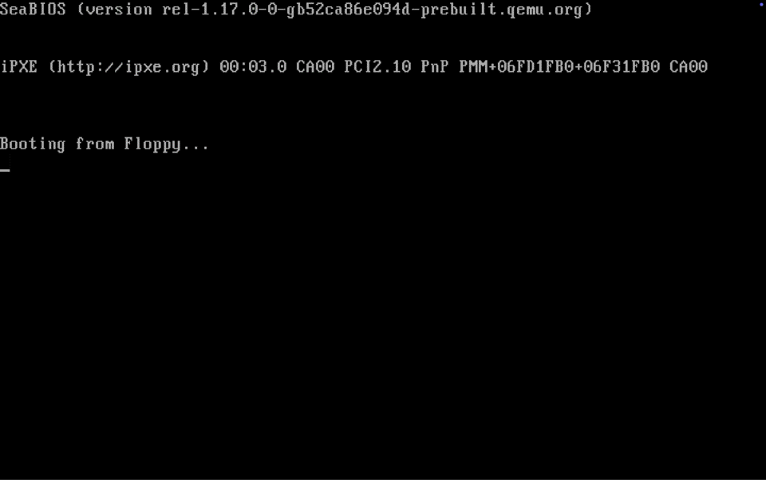

# Simple Kernel

This is a 32-bit monolithic x86 operating system kernel built from scratch in C and Assembly 

## Features
### Booting & System Architecture
*   Custom Multistage Bootloader:  Stage 1 and stage 2 bootloader written in x86 Assembly to transition the CPU into 32-bit protected mode and load the kernel binary into RAM.
*   Interrupthandler:   Custom interrupt descriptor table and assembly interrupt service routine wrappers for handling CPU exceptions and hardware interrupts.

### Drivers & Hardware
*   VGA Driver: Direct video memory access supporting color formatting, bounds-checked text output and cursor movement.
*   PS/2 Keyboard Driver:   Asynchronous keyboard handler for processing scan codes and key events.
*   Low-level Port I/O:     Hardware communication abstraction.

## Build & Run

### Prerequisites

*   Assembler:          `nasm`
*   Cross Compiler:     `gcc` or `x86_64-elf-gcc`
*   Linker:             `ld` or `x86_64-elf-ld`
*   Objdump:            `objdump` or `x86_64-elf-objdump`
*   QEMU:               `qemu-system-i386`
*   Make:               `make`

### Building & Running
1.  `cd OS`
2.  `mkdir -p build`    
3.  `cd build`
4.   Possibly Switch Build Tools In Makefile
5.  `make clean && make && make run`

## Controls
*   arrow keys: move cursor
*   ctl:        clear screen
*   f1:          reboot
*   tab: tab
*   enter: enter

## Future Plans
*   Virtual Memory & Paging
*   A Shell
*   Multitasking 